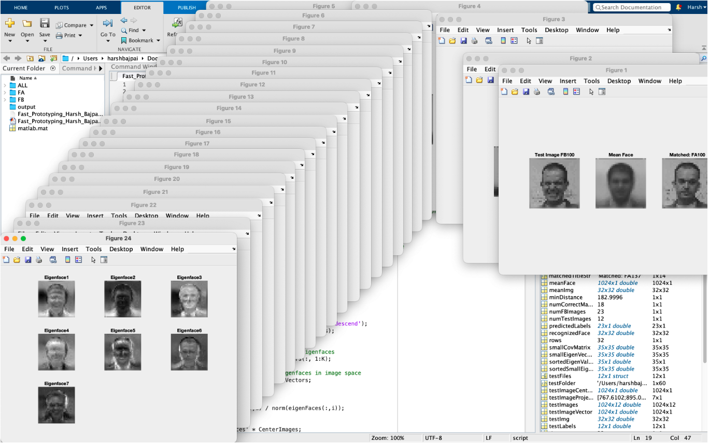

# Facial Recognition Using Eigenfaces

A MATLAB-based face recognition system that utilizes the Eigenface algorithm. Developed as part of a fast prototyping exercise for the graduate-level course **Pattern Analysis and Machine Intelligence**.

---

## 📁 Project Overview

This project implements facial recognition using **Principal Component Analysis (PCA)** to extract key features (Eigenfaces) from grayscale facial images. Recognition is performed using **nearest neighbor classification** in the reduced eigenspace.

---

## 📊 Dataset

- **Image Format:** 32×32 pixels, 8-bit grayscale
- **Training Set:** Combined images from `FA` and `FB` folders (`ALL`)
- **Testing Set:** 23 images from the `FB` folder

---

## 🧩 Components

### 1. Image I/O and Visualization
- Reads facial images from the dataset
- Displays grayscale images

### 2. PCA-Based Learning
- Flattens 32×32 images into 1D vectors
- Computes and subtracts the mean face
- Constructs a matrix of mean-subtracted vectors (`AfterSub`)
- Calculates the covariance matrix
- Extracts eigenvectors and eigenvalues to generate **Eigenfaces**

### 3. Face Recognition
- Projects test images into the eigenspace to compute their weights
- Compares test weights with training weights using **Euclidean distance**
- Classifies the test image based on the closest match

---

## 📈 Results

### 🔹 Match Results
- Test Image: FB100 → Best Match: FA100 | Confidence: 0.42%
- Test Image: FB101 → Best Match: FA101 | Confidence: 0.26%
- Test Image: FB103 → Best Match: FA103 | Confidence: 0.75%
- Test Image: FB106 → Best Match: FA106 | Confidence: 0.91%
- Test Image: FB106 → Best Match: FA135 | Confidence: 0.12%
- Test Image: FB106 → Best Match: FA136 | Confidence: 0.14%
- Test Image: FB107 → Best Match: FA107 | Confidence: 0.20%
- Test Image: FB107 → Best Match: FA107 | Confidence: 0.15%
- Test Image: FB107 → Best Match: FA107 | Confidence: 0.33%
- Test Image: FB107 → Best Match: FA107 | Confidence: 0.10%
- Test Image: FB107 → Best Match: FA107 | Confidence: 0.10%
- Test Image: FB107 → Best Match: FA107 | Confidence: 0.51%
- Test Image: FB107 → Best Match: FA106 | Confidence: 0.17%
- Test Image: FB107 → Best Match: FA107 | Confidence: 0.57%
- Test Image: FB107 → Best Match: FA135 | Confidence: 0.05%
- Test Image: FB107 → Best Match: FA107 | Confidence: 0.14%
- Test Image: FB128 → Best Match: FA128 | Confidence: 0.72%
- Test Image: FB131 → Best Match: FA131 | Confidence: 0.31%
- Test Image: FB132 → Best Match: FA132 | Confidence: 0.28%
- Test Image: FB133 → Best Match: FA133 | Confidence: 0.32%
- Test Image: FB135 → Best Match: FA103 | Confidence: 0.18%
- Test Image: FB136 → Best Match: FA136 | Confidence: 0.20%
- Test Image: FB137 → Best Match: FA137 | Confidence: 0.54%

- **Overall Recognition Rate:** 18/23 (78.26%)
- **Average Recognition Confidence:** 0.33%

---

### 🧠 Performance Analysis

I achieved a recognition rate of **78.26%**, correctly identifying 18 out of 23 test images. This reflects the best performance I was able to reach through numerous refinements of the Eigenface approach.

Key observations:
- **Confidence scores are generally low**, averaging just 0.33%, suggesting that while the system often identifies the correct match, it is uncertain in its predictions.
- Correct matches like FB100–FA100, FB101–FA101, and FB103–FA103 demonstrate the algorithm’s ability to identify consistent facial patterns.
- **Subject FB106** shows both the **highest confidence match (0.91%)** and **incorrect matches** with FA135 and FA136, indicating sensitivity to feature overlap across different identities.
- **Subject FB107** appears multiple times and is generally matched correctly with FA107, but with **significant confidence variability** (0.10% to 0.57%). One match with FA106 also indicates some ambiguity.
- **FB135 was incorrectly matched with FA103** rather than FA135, suggesting overlapping features in the eigenspace.
- Despite variations, many correct matches occurred even under low confidence scores, showing potential in the system's ability to generalize facial structures.

---

## ⚠️ Limitations

- **Test images overlap with training set**, which inflates accuracy.
- The system is sensitive to **lighting, pose, and expression variations**.
- Low confidence scores indicate limited certainty, especially in ambiguous cases.

---

## 🧪 Experimentation Summary

To improve performance, I explored:
- Varying the number of eigenfaces used for reconstruction and classification
- Applying different preprocessing strategies
- Modifying distance metrics (e.g., Euclidean, Mahalanobis)

Despite these iterations, the recognition rate plateaued at **78.26%**. Some subjects were consistently recognized, while others posed challenges likely due to data limitations or variability in facial conditions.

---

## 🛠️ Requirements

- MATLAB (Tested with R2021a or newer)
- Image Processing Toolbox

---

## 📸 Output Example

Below is a sample output of the system displaying recognition results and confidence scores:

